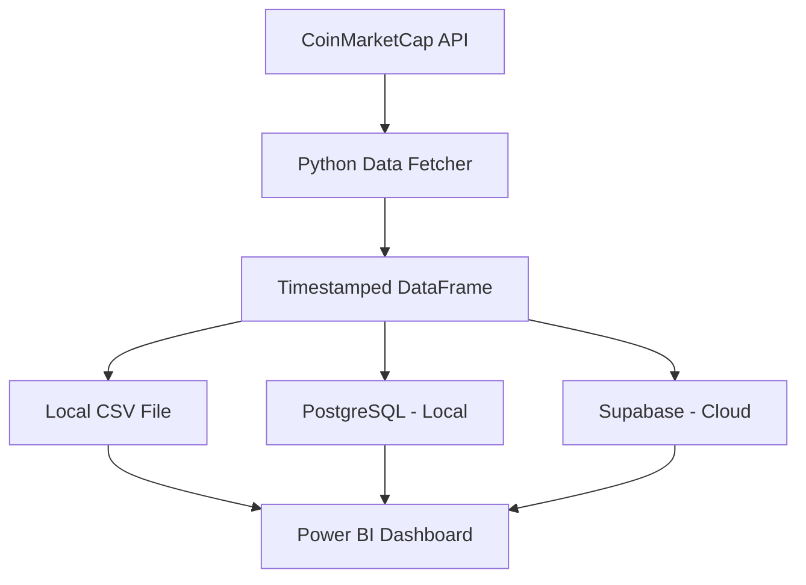

# Automated Cryptocurrency Data Pipeline & Power BI Dashboard

A robust, end-to-end cryptocurrency analytics solution built using the [CoinMarketCap API](https://coinmarketcap.com/), Python, PostgreSQL, Supabase, and Power BI. This project automates real-time data collection, storage, and visualization of key crypto market metrics, enabling fast, interactive insights.

---

## Project Overview

This project fetches live crypto data every **hour** using a scheduled Python job. The data is:

- Timestamped automatically
- Stored locally in CSV for quick Power BI prototyping
- Stored in **PostgreSQL** (local) for SQL-based EDA using tools like DBeaver
- Synced to **Supabase** (cloud PostgreSQL) for cloud-based querying and analytics

The result: a scalable and insightful dashboard that provides both macro and micro-level views of market performance, trends, and anomalies.

---

## Tech Stack

| Category       | Tool / Framework                          |
| -------------- | ----------------------------------------- |
| Data Source    | CoinMarketCap API                         |
| Data Ingestion | Python, `requests`, `pandas`              |
| Scheduling     | Local kernel (future: cron job online)    |
| Data Storage   | CSV, PostgreSQL (local), Supabase (cloud) |
| Query Tool     | DBeaver (for local PostgreSQL)            |
| Visualization  | Microsoft Power BI                        |

---

## Project Architecture



---

## Dashboard Features

Power BI dashboard is built with two fact tables:

- **Grouped Table:** Aggregated statistics for each cryptocurrency
- **Time-series Table:** Hourly snapshot of data for trend visualizations

Key visuals include:

- Trading Pair Liquidity (bar graph)
- Market Capitalization (treemap)
- Price in USD Over Time
- Percent Change (1h to 90d)
- Crypto Metadata (supply, dominance, volume, launch date)
- Dynamic Filters (select any coins for comparison)

---

## Sample Screenshots

- Complete top 15 crypto overview
- Individual and comparison dashboards
- Bitcoin-focused drill-down

---

## Automation Workflow

- **Data Pull Frequency:** Every hour (customizable)
- **Execution:** Currently scheduled via local Python kernel
- **Future Deployment:** Online automation using hosted cron jobs
- **Data Pipeline:** Python script fetches, timestamps, cleans, and inserts into all storage layers
- **Power BI:** Reads from CSV (quick prototyping) or PostgreSQL/Supabase for advanced querying

---

## Getting Started

### Folder Structure

```
.
├── Automating_API_Crypto_Pull.ipynb     # Main notebook/script
├── Cryptop_API.csv                      # Latest fetched data
├── crypto.pbix                          # Power BI dashboard file
├── /screenshots                         # Dashboard image previews
└── README.md
```

### Installation

```bash
# Clone this repository
git clone https://github.com/yourusername/crypto-dashboard.git
cd crypto-dashboard

# Install Python dependencies
pip install pandas requests sqlalchemy psycopg2
```

### Running the Script

```python
from requests import Request, Session
from requests.exceptions import ConnectionError, Timeout, TooManyRedirects
import json
from sqlalchemy import create_engine
import os
from time import time, sleep
```

```bash
# Run locally via Jupyter or Python
jupyter notebook Automating_API_Crypto_Pull.ipynb
# Or use a future online cron service for hourly execution
```

---

## Sample Data Column Overview

| Column                 | Description                            |
| ---------------------- | -------------------------------------- |
| `timestamp`            | When the data was fetched              |
| `symbol`               | Cryptocurrency ticker (e.g., BTC, ETH) |
| `price`                | Current price in USD                   |
| `volume_24h`           | Trading volume in last 24h             |
| `percent_change`       | Percentage changes                     |
| `market_cap`           | Current market capitalization          |
| `total_supply`         | Total minted tokens                    |
| `max_supply`           | Maximum allowable supply               |
| `more metrics`         | more metrics                           |
| `ecosystem`            | Ecosystem tag (e.g., Ethereum, Solana) |

---

## Future Enhancements

- Email or Telegram alerts for sudden price movements
- Full web deployment using Supabase and frontend dashboard
- Integrate ML forecasting models
- Improved data validation and anomaly detection mechanisms

---

## License

This project is licensed under the **MIT License** — feel free to fork and expand.

---

## Acknowledgements

- [CoinMarketCap API](https://coinmarketcap.com/api/)
- [Power BI by Microsoft](https://powerbi.microsoft.com/)
- [Supabase](https://supabase.com/)
- Open-source contributors to Python libraries used
